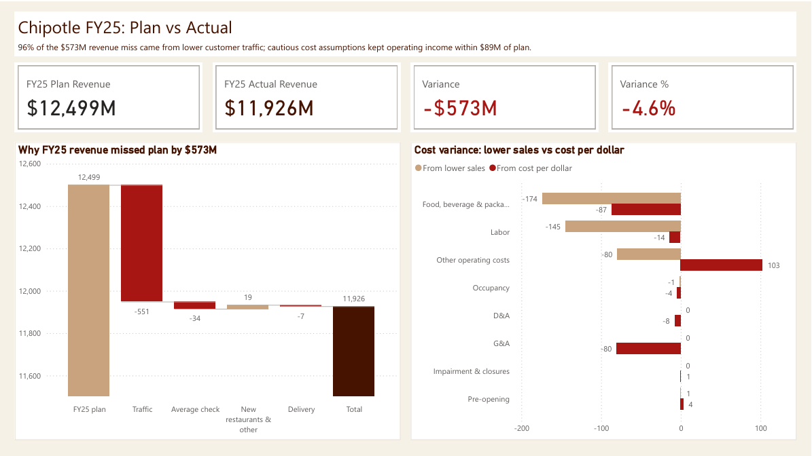
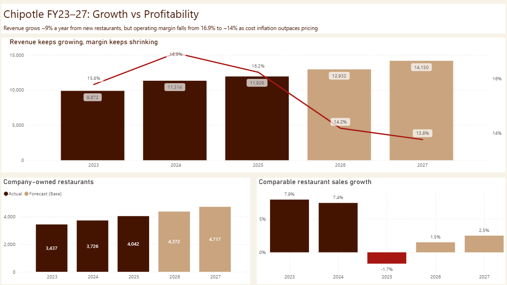
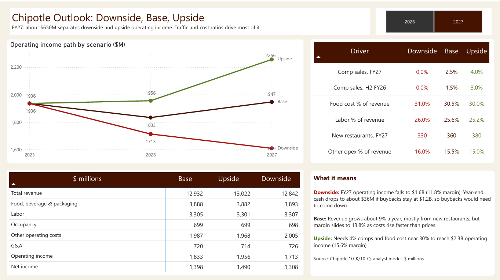

# Chipotle (CMG) Financial Model: FY25 Plan vs Actual and FY26–27 Forecast

A three-statement financial model of Chipotle Mexican Grill, built in Excel from SEC filings. It backtests a FY25 plan against actual results, forecasts FY26–27, and feeds a Power BI dashboard.

## Overview

The project follows a normal FP&A cycle:

1. **Plan.** Built a FY25 operating plan using only information public as of Feb 4, 2025, then froze it.
2. **Actual vs plan.** Compared the plan to reported FY25 results and broke down the variance (revenue bridge, volume vs rate on costs).
3. **Forecast.** Rolled forward into a linked income statement, balance sheet and cash flow for FY26–27. FY26 is H1 actuals plus an H2 forecast.
4. **Scenarios.** Downside, base and upside cases, switched from one cell.

## Results

| $M | FY25 Plan | FY25 Actual | Variance |
|---|---|---|---|
| Revenue | 12,499 | 11,926 | (573) |
| Operating income | 2,025 | 1,936 | (89) |
| Operating margin | 16.2% | 16.2% | – |

- Traffic explains $551M of the $573M revenue miss. I planned transactions at +2.0% and they came in at -2.9%.
- Operating income held up better because the cost assumptions were conservative (food 29.6% actual vs 30.3% plan).
- Other operating costs were only $23M over plan in total, but $103M over on a rate basis once the volume effect is taken out. My first guess was new store openings, but openings were on plan, so the likelier causes are fixed costs on lower sales and higher marketing spend.
- Base case: revenue grows ~8–9% a year, mostly from new units, while operating margin falls to ~14%. FY27 operating income ranges from $1.6B (downside) to $2.3B (upside).

The full write-up is in the [memo](Memo_CMG_FY25_review_and_FY26-27_outlook.md).

## Files

```
CMG_FPA_Model.xlsx                               Excel financial model
Memo_CMG_FY25_review_and_FY26-27_outlook.md      One-page management memo
CMG_FPA_Dashboard.pbix                           Power BI dashboard
CMG_FPA_Dashboard.pdf                            Dashboard export
CMG_PowerBI_Data.xlsx                            Dashboard data (from the workbook)
screenshots/                                     Dashboard images
```

## Workbook structure

| Tab | Contents |
|---|---|
| Cover & Checks | Sources and 15 integrity checks |
| Historicals | FY23–25 statements and restaurant KPIs, as filed |
| Analysis | Margins, unit economics, working capital |
| Assumptions | FY25 plan inputs and management guidance |
| FY25 Plan vs Actual | Variance, revenue bridge, volume/rate split, notes |
| Scenarios | Forecast drivers and scenario switch (cell B4) |
| IS / BS / CF Forecast | Linked three-statement forecast, FY26E–FY27E |
| H1 2026 Checkpoint | H1 2026 vs H1 2025 from the Q2 10-Q |

Blue cells are inputs or figures typed from filings, and black cells are formulas. The checks confirm the balance sheet balances, cash ties to the cash flow statement, and key figures tie back to the filings. All 15 pass.

## Power BI dashboard

Three pages: why FY25 missed plan, growth vs profitability FY23–27, and the FY27 scenario range.





The data model is a star schema with a long-format fact table and dimensions for line item, scenario and year, plus DAX measures for revenue, operating income, margin and plan vs actual variance.

## Limitations

- Comp growth is applied to all prior-year revenue. Chipotle's comps only include restaurants open 13+ months.
- New restaurant revenue is a residual and assumes half a year of sales for new openings. In the bridge, "new restaurants & other" is a plug.
- Costs are forecast as a % of revenue, so operating leverage isn't captured and the upside case is likely understated.
- Investments are held at the June 30, 2026 balance, and buybacks are inputs.
- FY25 actuals come from the Q4 2025 earnings release and are not yet tied to the audited 10-K.
- The FY25 plan is my own, not Chipotle's internal budget.

## Sources

- Form 10-K, FY2023 and FY2024
- Q4 2024 and Q4 2025 earnings releases (8-K), including guidance
- Form 10-Q, Q1 and Q2 2026

All from [SEC EDGAR](https://www.sec.gov/cgi-bin/browse-edgar?action=getcompany&CIK=0001058090).
